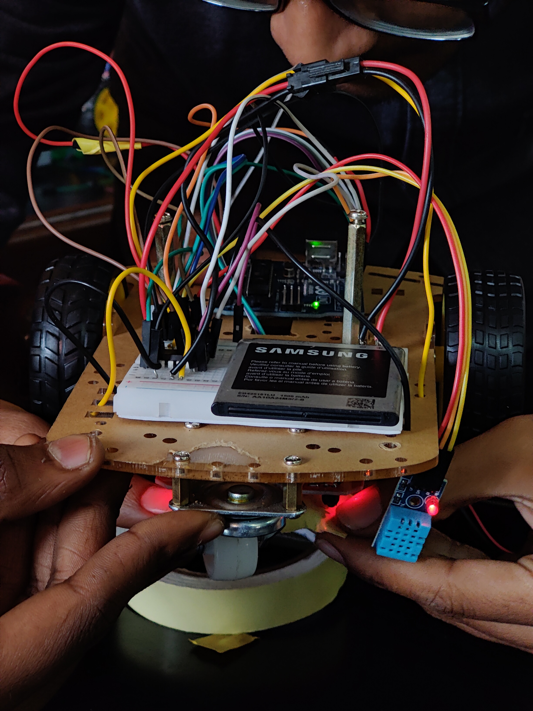
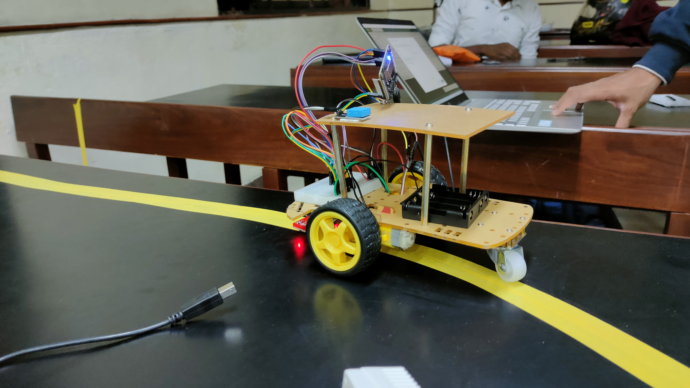
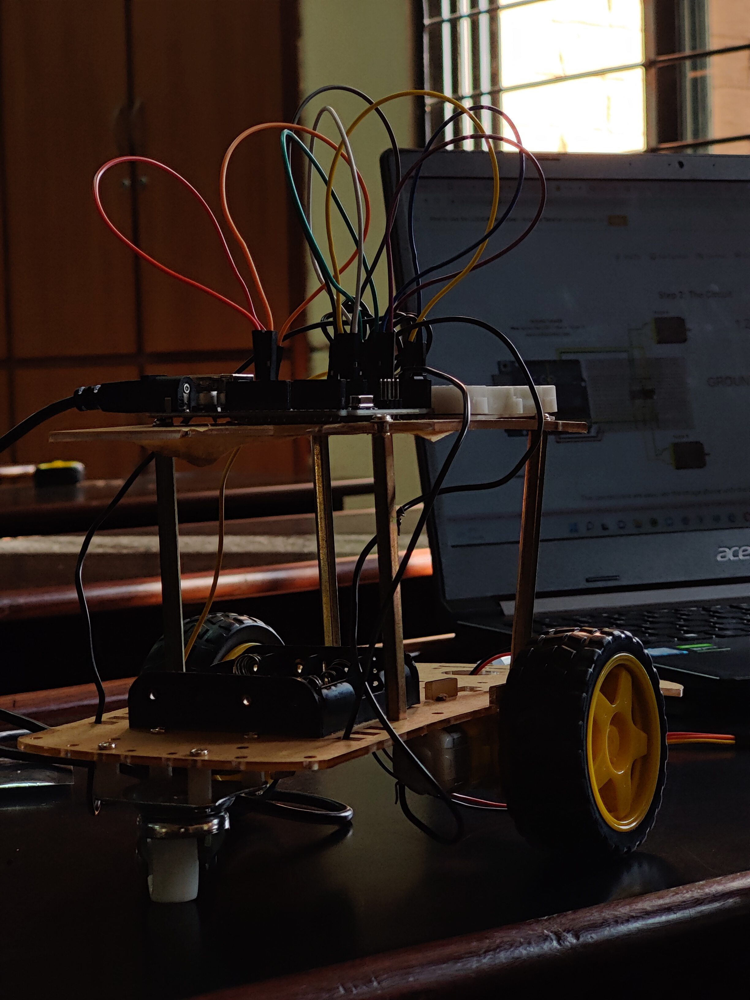

# 🕹️ BYOB (Bring Your Own Board) 🕹️

#### This repository contains the IOT🔌project for the competition BYOB.
In this project we made use of the microcontroller Generic ESP8266 NodeMCU. Our project was to built a electric powered vehicle 🚌 that follows a given path and stops where-ever the humidity is the highest.

## 🎛️ Components Required 🎚️:
- Generic ESP8266 NodeMCU
- Jumper wires.
- Infrared Tracking Sensor Module CTRT5000
- DHT11 sensor
- DC BO Motor Dual Shaft motor 

            

